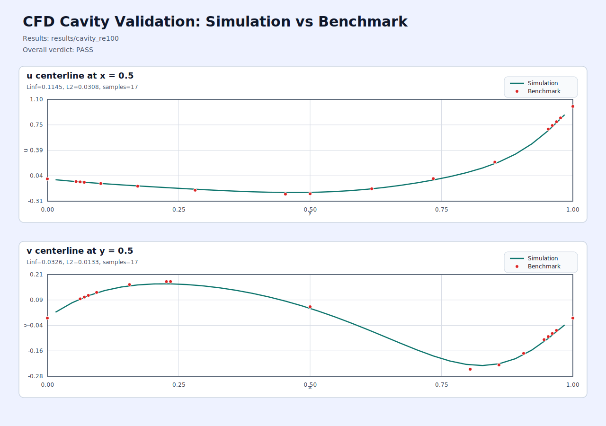

# CFD FVM SIMPLE Solver With Eigen

A small C++ CFD project that implements a 2D steady incompressible lid-driven cavity solver with the SIMPLE algorithm and Eigen-based sparse linear solvers.

## What Is In This Repo

- Finite-volume SIMPLE solver for a collocated grid
- Rhie-Chow style face-velocity coupling to stabilize pressure-velocity coupling
- Command-line executable for the cavity benchmark case
- Unit and smoke tests
- Benchmark comparison against Ghia Re=100 centerline data
- Validation plot output for simulation vs benchmark

## Current Scope

This repository currently targets one focused case:

- 2D
- steady-state
- incompressible
- laminar
- lid-driven cavity
- `Re = 100` benchmark validation

It is not a general-purpose CFD framework. Unstructured meshes, turbulence models, transient schemes, and complex geometries are out of scope for this version.

## Quick Start

Eigen is expected either in `third_party/eigen` or via `-DEIGEN3_INCLUDE_DIR=/path/to/eigen3`.

```bash
cmake -S . -B build -DCMAKE_BUILD_TYPE=Release
cmake --build build -j
ctest --test-dir build --output-on-failure
./build/cfd_solver --case cavity --nx 32 --ny 32 --re 100 --max-iters 2000 --min-iters 100 --alpha-u 0.5 --alpha-v 0.5 --alpha-p 0.3 --output-dir results/cavity_re100
python3 scripts/validate_cavity.py --results results/cavity_re100
```

## Validation

The validator compares the simulation centerlines with benchmark data and writes:

- `validation_summary.json`
- `validation_plot.svg`

Latest checked result in this workspace:

- `u` centerline: `Linf = 0.1145`, `L2 = 0.0308`
- `v` centerline: `Linf = 0.0326`, `L2 = 0.0133`

Validation image:



## Theory Notes

- [docs/simple_solver_theory.md](docs/simple_solver_theory.md) explains the current SIMPLE, Rhie-Chow, and pressure-correction implementation using the same symbols that appear in code.

## Repository Layout

- `include/` public solver headers
- `src/` solver implementation
- `docs/` theory notes and implementation-aligned documentation
- `tests/` unit and smoke tests
- `scripts/validate_cavity.py` benchmark comparison script
- `data/benchmarks/` reference centerline data
- `results/cavity_re100/` example validation outputs
- `third_party/eigen/` vendored Eigen snapshot used for local builds

## Third-Party Dependency

This repository vendors Eigen as a source snapshot under `third_party/eigen/`.

- Upstream: `https://gitlab.com/libeigen/eigen.git`
- Snapshot commit: `118ea02645ad89e9f1c44add27f81701e4561920`
- Snapshot date: `2026-04-11`

The vendored copy is committed as ordinary source files, not as a Git submodule.

## Vibe Coding Declaration

This codebase was developed with heavy AI assistance in a vibe-coding workflow.

That means:

- design and implementation were accelerated with AI-generated code and iterative prompting
- the repository should be treated as an experimental engineering artifact, not as a certified solver
- you should review, test, and validate the code yourself before using it for production, safety-critical, or publication-grade work

## License

This project is released under the MIT License. See [LICENSE](LICENSE).
Vendored third-party code keeps its own upstream license files inside `third_party/eigen/`.
